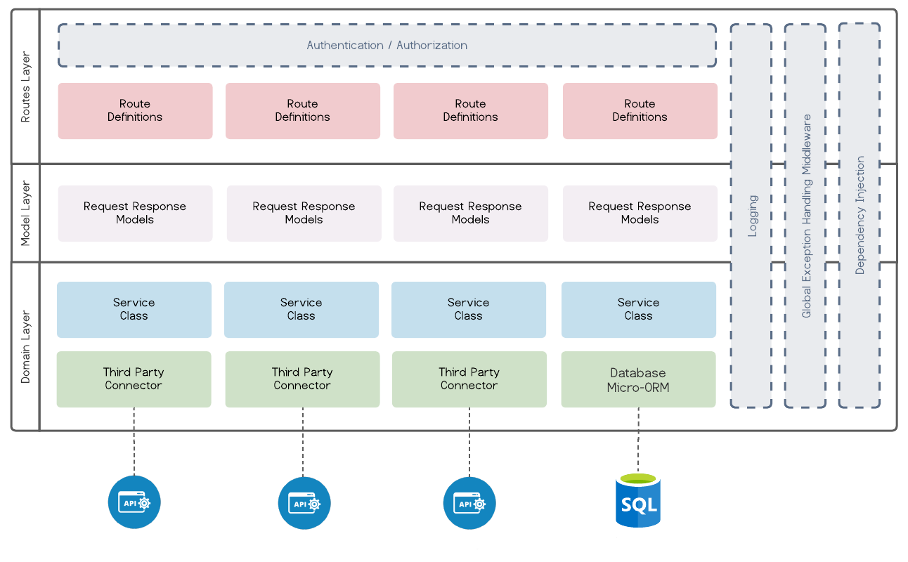
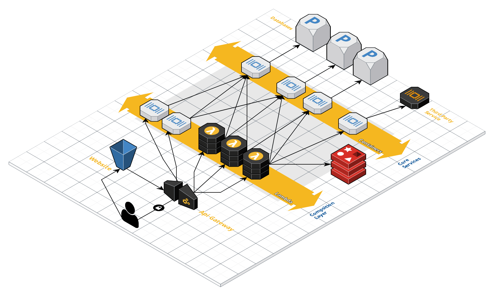

 
 
Looking for code? [Github Repositories](https://github.com/zeroslope-arch)

## What is the ZeroSlope Platform

About 10 years ago, I started working on a .net scaffold specifically around my [Dependency Injection Composition Root](https://medium.com/@cfryerdev/dependency-injection-composition-root-418a1bb19130) pattern. I wanted to create super lean and performant scaffold I could drop into a new project and get running quickly. It evolved into a way to introduce other engineers to Composition Root. What I discovered during this phase, was how approachable the pattern was to engineers of most any skill level. I decided to pivot my scaffold to focus on two main principals; **Lean Architecture** & **Developer Adoption**.

What does the name mean? In algebra, a zero slope is a straight horizonal line. I strongly believe that a good microservice architecture should mainly scale horizontally with load.

To avoid analysis paralysis and ensure what I was developing would stay true to the idea I had in my head, I came up with a series of tenets that I can always look back on and make sure I am making the right architectural decisions.

### The Tenets of ZeroSlope

* **Developer Focused**: Developer quality of life is the largest focus of the pattern. When at a crossroads on a design pattern, whichever leans closer to developer maintainability should win.
* **Developer Adoption**: The pattern and processes should lend to developers of all skill levels to work within it. The more comfortable or skillful the developer, the deeper into the stack they can work.
* **Lean and Clean**: The pattern should have minimal abstraction that does not remove the need to repeat configuration, or repeat code usage. ie: The pipeline should always be abstracted away from everyday developer use. No code should live within controllers other than service method calls. When possible, use nuget/npm packages to remove redundant framework setup.
* **Simple Composition**: The framework is made up of Pipeline, Controllers, Services, and (not always) Composition Root. As part of #3, this framework should be lean and be familiar to developers as they onboard into the framework.
* **Language Agnostic**: Aside from language specific requirements, a developer should be able to move from Java ZeroSlope to Node ZeroSlope to .net Core ZeroSlope. They should find the general structure and naming conventions to be familiar which will boost developer confidence and velocity.


## Code generation

ZeroSlope is available via yeoman, to install and set up yeoman and the zeroslope template:

```bash
npm install -g yo
npm install -g generator-zeroslope
```

You can now simply run the following command and just answere a few quick questions.

```bash
yo zeroslope
```

## Technical Concepts

### Horizontally scaling

If an engineer was working on the Java variant of ZeroSlope, and needed to work on a .net project with little to no experience in .net, hopefully the platform would provide a jumping-off point to get the engineer comfortable quickly.


### Switching Technologies

If an engineer was working on the Java variant of ZeroSlope, and needed to work on a .net project with little to no experience in .net, hopefully the platform would provide a jumping-off point to get the engineer comfortable quickly.


### Self Promotional Architecture

One concept I really wanted to focus on with this platform was the idea that the architecture would encourage engineers to learn at their own page. I want engineers to be able to dive as deep into the pattern as they feel comfortable.

### Dockerized from the start

Each ZeroSlope variant comes with Docker support out of the box, providing you with a Dockerfile allowing you to run your solution in the widest array of solutions possible.

### Cloud Provider Support

ZeroSlope will fully support all three major cloud providers (Aws, Azure, Google Cloud) using Terraform. Given each variant of ZeroSlope is dockerized, we can keep our infrastructure code generic and give you a great place to start.


### Platform Support

So far, ZeroSlope comes in a few flavors:

* Net 6 Minimal Api
* DotNet Core 2.2 WebApi
* GoLang using Gin
* Java 8 Spring Boot
* Node ExpressJS with Typescript

## Solution Architecture

 

## Cloud Composition Architecture

ZeroSlope works perfectly with the composition layer approach to cloud architecture.  (As shown and described below)



### Composition Layer

ZeroSlope provides lean microservices and/or lambda architectures for use in the composition layer which is primarily responsible for holding business logic and orchestrating call(s) to core services.

### Core Services Layer

ZeroSlope can also be used in the core services layer where scalability and resiliency is an absolutye must. In the core services layer, we build mostly static, highly performance microservices which provide only functionality and extensibility, but no business rule based logic.


### More infromation

For more information, head over to the GitHub organization: [Github Repositories](https://github.com/zeroslope-arch)
